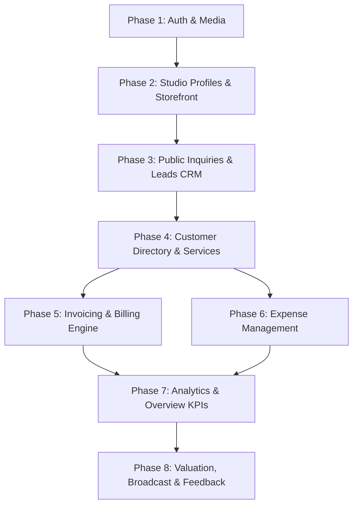

# Shopwus API Specification & Progressive Integration Roadmap

> **Target Frontend**: `shopwus-web` (Next.js 15 App Router)  
> **Target Backend**: `shopwus-api` (Fastify + Prisma + PostgreSQL)  
> **Architecture Pattern**: Multi-tenant studio workspace, JWT/Session Auth, RESTful v1 endpoints.

This document details all APIs required to replace current mock/dummy data in `shopwus-web`, organized in a **strict progressive implementation order** to ensure zero breaking changes during development.

---

## Table of Contents
1. [Progressive Implementation Order (Phases Overview)](#progressive-implementation-order)
2. [Phase 1: Authentication, Tenant Context & Media Engine](#phase-1-authentication-tenant-context--media-engine)
3. [Phase 2: Studio Profiles & Public Storefront](#phase-2-studio-profiles--public-storefront)
4. [Phase 3: Inbound Inquiries & Leads CRM](#phase-3-inbound-inquiries--leads-crm)
5. [Phase 4: Customer Directory & Client Services](#phase-4-customer-directory--client-services)
6. [Phase 5: Invoicing, Billing & PDF Generation](#phase-5-invoicing-billing--pdf-generation)
7. [Phase 6: Expense Tracking & Financials](#phase-6-expense-tracking--financials)
8. [Phase 7: Dashboard Analytics & Performance Metrics](#phase-7-dashboard-analytics--performance-metrics)
9. [Phase 8: Growth, Valuation, Blog & Engagement Tools](#phase-8-growth-valuation-blog--engagement-tools)
10. [Frontend Service Mapping Reference Table](#frontend-service-mapping-reference-table)

---

## Progressive Implementation Order

To prevent frontend downtime and allow seamless incremental replacement of mock data, implement and connect APIs in this exact dependency order:



---

## Phase 1: Authentication, Tenant Context & Media Engine

> **Replaces**: `src/services/api/auth.service.ts`, `src/services/api/media.service.ts`, `STORAGE_KEYS.session` mock objects.

### 1.1 Authentication & Session

#### `POST /api/v1/auth/google`
- **Purpose**: Authenticate or register a studio owner via Google OAuth ID token.
- **Request Body**:
  ```json
  {
    "idToken": "string",
    "claimSlug": "string (optional)"
  }
  ```
- **Response `200 OK`**:
  ```json
  {
    "token": "jwt-access-token",
    "refreshToken": "jwt-refresh-token",
    "user": {
      "id": "usr-123",
      "name": "Elena Vance",
      "email": "elena@atelierforma.design",
      "role": "owner",
      "studioId": "biz-123",
      "studioName": "Atelier Forma",
      "studioSlug": "atelier-forma",
      "avatarUrl": "https://..."
    }
  }
  ```

#### `POST /api/v1/auth/signup`
- **Purpose**: Register a new studio account and claim a custom studio slug.
- **Request Body**:
  ```json
  {
    "fullName": "Elena Vance",
    "email": "elena@atelierforma.design",
    "studioName": "Atelier Forma",
    "slug": "atelier-forma",
    "googleIdToken": "string (optional)"
  }
  ```
- **Response `201 Created`**: User session and studio details.

#### `GET /api/v1/auth/me`
- **Purpose**: Retrieve current logged-in user profile and studio permissions (used in root layout / auth guards).
- **Headers**: `Authorization: Bearer <token>`
- **Response `200 OK`**: `UserSession`

#### `POST /api/v1/auth/logout`
- **Purpose**: Invalidate current refresh token / session.

---

### 1.2 Media & Asset Uploads

#### `POST /api/v1/media/upload/logo`
- **Purpose**: Upload business logo with automatic resizing and CDN URL return.
- **Payload**: `multipart/form-data` (`file`)
- **Response `200 OK`**: `{ "url": "https://cdn.shopwus.com/logos/biz-123.webp" }`

#### `POST /api/v1/media/upload/portfolio`
- **Purpose**: Upload high-res portfolio project images.
- **Payload**: `multipart/form-data` (`file`, `projectId` optional)
- **Response `200 OK`**: `{ "url": "https://cdn.shopwus.com/portfolio/img-456.webp" }`

---

## Phase 2: Studio Profiles & Public Storefront

> **Replaces**: `src/services/api/profile.service.ts`, `src/app/(studio)/[slug]`, `src/app/(admin)/profile`

### 2.1 Public Storefront APIs (Unauthenticated)

#### `GET /api/v1/studios/:slug`
- **Purpose**: Fetch complete public storefront for a studio (theme, hero, services, portfolio, reviews, business hours, contact channels).
- **Response `200 OK`**:
  ```json
  {
    "id": "biz-101",
    "slug": "atelier-forma",
    "businessName": "Atelier Forma",
    "tagline": "Architectural Scenography & Luxury Weddings",
    "description": "High-end bespoke event production...",
    "location": "Victoria Island, Lagos",
    "email": "hello@atelierforma.design",
    "phone": "+234 803 123 4567",
    "whatsAppNumber": "+234 803 123 4567",
    "logoUrl": "https://...",
    "businessType": "service",
    "currency": "NGN",
    "colors": {
      "primary": "#1A1A1A",
      "secondary": "#E5E5E5",
      "button": "#2C3E50",
      "pageBackground": "#FAFAFA",
      "cardBackground": "#FFFFFF",
      "text": "#111111"
    },
    "buttonRadius": "rounded-full",
    "operatingHours": "Mon - Fri: 9:00 AM - 6:00 PM",
    "byAppointmentOnly": true,
    "services": [
      {
        "id": "srv-1",
        "name": "Full Wedding Scenography",
        "category": "Weddings",
        "description": "End-to-end spatial design and direction"
      }
    ],
    "portfolio": [
      {
        "id": "port-1",
        "title": "The Glasshouse Gala",
        "category": "Corporate",
        "location": "Eko Atlantic",
        "image": "https://...",
        "gallery": ["https://..."]
      }
    ],
    "reviews": [
      {
        "id": "rev-1",
        "author": "Folake Adeleke",
        "rating": 5,
        "comment": "Exceptional curation and flawless delivery.",
        "date": "2026-07-15"
      }
    ]
  }
  ```

#### `GET /api/v1/studios/check-slug?slug=:slug`
- **Purpose**: Instant slug uniqueness check during onboarding or profile editing.
- **Response `200 OK`**: `{ "slug": "my-studio", "isAvailable": true }`

#### `POST /api/v1/studios/:slug/reviews`
- **Purpose**: Allow clients to submit public testimonials/reviews on the storefront.
- **Request Body**:
  ```json
  {
    "author": "Amara Sterling",
    "role": "Bride",
    "eventType": "Wedding",
    "rating": 5,
    "comment": "Truly unforgettable experience."
  }
  ```

---

### 2.2 Studio Admin Profile APIs (Authenticated)

#### `GET /api/v1/studios/me`
- **Purpose**: Fetch studio configuration for editing in the Admin Profile view.

#### `PUT /api/v1/studios/me`
- **Purpose**: Update studio metadata, theme colors, branding, services, and portfolio projects.
- **Request Body**: Full/partial `BusinessProfile` payload.

#### `POST /api/v1/studios/me/publish`
- **Purpose**: Publish draft profile updates live to the public studio storefront.

#### `POST /api/v1/studios/me/social-channels/:channelId/connect`
- **Purpose**: Link and verify studio social media accounts (Instagram, WhatsApp, Facebook).

---

## Phase 3: Inbound Inquiries & Leads CRM

> **Replaces**: `src/services/api/leads.service.ts`, `src/app/(admin)/leads`, Studio consultation form.

### 3.1 Public Lead Capture

#### `POST /api/v1/studios/:slug/inquiries`
- **Purpose**: Consultation inquiry booking form on the studio storefront page.
- **Request Body**:
  ```json
  {
    "name": "Chioma Eze",
    "email": "chioma@example.com",
    "phone": "+234 802 000 1122",
    "service": "Full Wedding Production",
    "services": ["Floral Architecture", "Lighting"],
    "eventDate": "2026-11-20",
    "budget": 25000000,
    "message": "Looking for bespoke production in Lagos."
  }
  ```
- **Response `201 Created`**: `{ "id": "lead-101", "status": "new", "createdAt": "..." }`

---

### 3.2 Lead Management (Admin)

#### `GET /api/v1/leads`
- **Purpose**: Paginated list of studio inquiries.
- **Query Params**: `?q=...&status=new|contacted|qualified|converted|lost&page=1&limit=20`
- **Response `200 OK`**: `{ "items": [Lead], "total": 42, "page": 1 }`

#### `GET /api/v1/leads/:id`
- **Purpose**: Retrieve single lead details and associated consultation history.

#### `POST /api/v1/leads`
- **Purpose**: Manually create a lead from admin inquiry/phone walk-in.

#### `PATCH /api/v1/leads/:id/status`
- **Purpose**: Transition lead status pipeline (`new` -> `contacted` -> `qualified` -> `converted` / `lost`).
- **Request Body**: `{ "status": "qualified" }`

#### `POST /api/v1/leads/:id/convert`
- **Purpose**: Convert lead to registered Customer, creating initial customer record and starting service scope.
- **Request Body**:
  ```json
  {
    "serviceName": "Full Wedding Production",
    "amount": 15000000,
    "createDraftInvoice": true
  }
  ```
- **Response `200 OK`**: `{ "customer": Customer, "invoice": Invoice (optional) }`

#### `GET /api/v1/leads/export`
- **Purpose**: Download leads as CSV spreadsheet.

---

## Phase 4: Customer Directory & Client Services

> **Replaces**: `src/services/api/customer.service.ts`, `src/app/(admin)/customers`

### 4.1 Customer CRUD & Directory

#### `GET /api/v1/customers`
- **Purpose**: Searchable, filterable client list with computed total revenue and service count.
- **Query Params**: `?q=...&isActive=true|false&page=1&limit=50`
- **Response `200 OK`**: `{ "items": [Customer], "total": 120 }`

#### `GET /api/v1/customers/:id`
- **Purpose**: Customer profile, active/past services, invoices, and timeline activity audit log.

#### `POST /api/v1/customers`
- **Purpose**: Add new customer with initial optional service.
- **Request Body**:
  ```json
  {
    "name": "Adeola Adeleke",
    "email": "adeola@example.com",
    "phone": "+234 803 123 4567",
    "company": "Adeleke & Co.",
    "serviceName": "Brand Strategy Retainer",
    "service": "Branding",
    "amount": 5000000,
    "status": "active"
  }
  ```

#### `PUT /api/v1/customers/:id`
- **Purpose**: Update customer basic contact and billing details.

#### `PATCH /api/v1/customers/:id/status`
- **Purpose**: Toggle active/archived state (`isActive: boolean`).

#### `DELETE /api/v1/customers/:id`
- **Purpose**: Remove customer record (with cascade safety check on paid invoices).

---

### 4.2 Customer Services & Scopes

#### `POST /api/v1/customers/:id/services`
- **Purpose**: Add a new deliverable/scope under a customer.
- **Request Body**:
  ```json
  {
    "name": "Stage Scenography Addon",
    "service": "Event Production",
    "amount": 2500000,
    "status": "pending"
  }
  ```

#### `PATCH /api/v1/customers/:id/services/:serviceId/status`
- **Purpose**: Update scope status (`pending` | `active` | `completed` | `cancelled`).

#### `DELETE /api/v1/customers/:id/services/:serviceId`
- **Purpose**: Delete a specific service line.

---

### 4.3 Bulk Data Operations

#### `POST /api/v1/customers/import`
- **Purpose**: Bulk import customer register from CSV records (`name`, `phone`, `email`, `notes`).
- **Request Body**: `[{ "name": "...", "phone": "...", "email": "...", "notes": "..." }]`
- **Response `200 OK`**: `{ "imported": 25, "customers": [Customer] }`

#### `GET /api/v1/customers/export`
- **Purpose**: Stream CSV export of full customer database.

---

## Phase 5: Invoicing, Billing & PDF Generation

> **Replaces**: `src/services/api/invoice.service.ts`, `src/app/(admin)/invoices`

### 5.1 Invoices CRUD & Workflow

#### `GET /api/v1/invoices`
- **Purpose**: List invoices, filter by status (`draft`, `sent`, `paid`, `overdue`, `cancelled`) or customer ID.
- **Query Params**: `?status=...&customerId=...&q=...`

#### `GET /api/v1/invoices/:id`
- **Purpose**: Full invoice details, line items, tax calculations, and dispatch audit history.

#### `POST /api/v1/invoices`
- **Purpose**: Create and persist an invoice (or draft).
- **Request Body**:
  ```json
  {
    "customerId": "cust-101",
    "customerName": "Amara Sterling",
    "customerEmail": "amara@sterling.com",
    "billingAddress": "42 Victoria Island Boulevard, Lagos",
    "issueDate": "2026-08-20",
    "dueDate": "2026-09-03",
    "paymentTerms": "Net 14",
    "currency": "NGN",
    "items": [
      {
        "description": "Full Wedding Production",
        "quantity": 1,
        "unit": "package",
        "unitPrice": 38000000,
        "amount": 38000000
      }
    ],
    "subtotal": 38000000,
    "discount": 0,
    "taxRate": 7.5,
    "taxAmount": 2850000,
    "total": 40850000,
    "notes": "Initial deposit confirmed.",
    "status": "draft"
  }
  ```

#### `PUT /api/v1/invoices/:id`
- **Purpose**: Modify an existing draft invoice.

#### `POST /api/v1/invoices/:id/send`
- **Purpose**: Finalize invoice, assign official sequential `invoiceNumber` (e.g., `INV-2026-042`), and email PDF to recipient.

#### `POST /api/v1/invoices/:id/resend`
- **Purpose**: Resend invoice notification to the customer's email.

#### `PATCH /api/v1/invoices/:id/status`
- **Purpose**: Mark invoice as `paid` or `unpaid` / `cancelled`.

#### `DELETE /api/v1/invoices/:id`
- **Purpose**: Delete invoice (restricted if marked as paid).

---

### 5.2 PDF & Dispatch Utilities

#### `GET /api/v1/invoices/:id/pdf`
- **Purpose**: Generate and stream official branded PDF document.

#### `POST /api/v1/customers/:customerId/invoices/send`
- **Purpose**: Quick one-click invoice creation and dispatch from the customer overview card.

---

## Phase 6: Expense Tracking & Financials

> **Replaces**: `src/services/api/expense.service.ts`, `src/app/(admin)/expenses`

### 6.1 Expenses CRUD

#### `GET /api/v1/expenses`
- **Purpose**: List studio expenses with filtering by category, date range, and payment method.
- **Query Params**: `?category=...&startDate=...&endDate=...&q=...`

#### `GET /api/v1/expenses/:id`
- **Purpose**: Retrieve single expense details and receipt attachment.

#### `POST /api/v1/expenses`
- **Purpose**: Record new studio expense.
- **Request Body**:
  ```json
  {
    "description": "Floral Wholesaler Consignment",
    "category": "materials",
    "amount": 4200000,
    "date": "2026-08-22",
    "paymentMethod": "transfer",
    "vendor": "Lagos Bloom Market",
    "receiptUrl": "https://...",
    "taxDeductible": true
  }
  ```

#### `PUT /api/v1/expenses/:id`
- **Purpose**: Update expense entry.

#### `DELETE /api/v1/expenses/:id`
- **Purpose**: Delete expense entry.

---

### 6.2 Expense Summaries & Analytics

#### `GET /api/v1/expenses/summary`
- **Purpose**: Get overall total spent, current monthly spend, budget utilization, and top expense category.
- **Response `200 OK`**:
  ```json
  {
    "totalSpent": 14200000,
    "monthlySpent": 3500000,
    "budget": 5000000,
    "budgetUtilization": 70,
    "topCategory": "materials"
  }
  ```

#### `GET /api/v1/expenses/categories`
- **Purpose**: Aggregated expense breakdown grouped by category with percentages for donut chart.

#### `GET /api/v1/expenses/export`
- **Purpose**: Export expense report as CSV.

---

## Phase 7: Dashboard Analytics & Performance Metrics

> **Replaces**: `src/services/api/analytics.service.ts`, `src/app/(admin)/overview`, `src/app/(admin)/analytics`

#### `GET /api/v1/analytics/overview?timeframe=daily|weekly|monthly|quarterly|yearly`
- **Purpose**: Studio admin overview KPIs.
- **Response `200 OK`**:
  ```json
  {
    "revenue": {
      "current": 84500000,
      "previous": 72000000,
      "growthRate": 17.3
    },
    "netProfit": {
      "current": 70300000,
      "margin": 83.2
    },
    "leads": {
      "total": 64,
      "converted": 28,
      "conversionRate": 43.7
    },
    "invoices": {
      "paidCount": 18,
      "pendingCount": 4,
      "pendingAmount": 12500000
    },
    "recentActivities": [
      {
        "id": "act-1",
        "type": "invoice_paid",
        "description": "Invoice INV-2026-001 paid by Amara Sterling",
        "timestamp": "2026-08-20T10:15:00Z"
      }
    ]
  }
  ```

#### `GET /api/v1/analytics/revenue-chart?timeframe=monthly`
- **Purpose**: Time-series points for historical revenue vs. expenses bar/area chart.

#### `GET /api/v1/analytics/funnel`
- **Purpose**: Inquiries -> Contacted -> Qualified -> Proposal -> Won conversion funnel statistics.

#### `GET /api/v1/analytics/services-performance`
- **Purpose**: Ranking of top studio services by deal count and revenue generated.

---

## Phase 8: Growth, Valuation, Blog & Engagement Tools

> **Replaces**: `valuation.service.ts`, `blog.service.ts`, `broadcast.service.ts`, `feedback.service.ts`

### 8.1 Valuation Engine (`/valuation-calculator`)
- `POST /api/v1/valuation/calculate-public`: Unauthenticated valuation calculation from revenue, profit margin, industry multiple, and client concentration.
- `POST /api/v1/valuation/calculate-advanced`: Authenticated valuation automatically pulling actual studio ledger data.

### 8.2 Client Broadcasts (`broadcast.service.ts`)
- `POST /api/v1/broadcasts/send`: Dispatches WhatsApp / Email campaigns to client segments.
- `GET /api/v1/broadcasts/history`: Campaign delivery logs and open/interaction rates.

### 8.3 Blog & Editorial (`/blog`, `/blog/[slug]`)
- `GET /api/v1/blog/posts`: Paginated published editorial articles with category filters.
- `GET /api/v1/blog/posts/:slug`: Full markdown/rich content of an article.
- `GET /api/v1/blog/posts/:slug/related`: Category-matched related posts.

### 8.4 Feedback & Feature Requests (`feedback.service.ts`)
- `POST /api/v1/feedback`: In-app feedback submission from studio directors.
- `GET /api/v1/feedback`: List of public roadmap feature suggestions with upvotes.

---

## Frontend Service Mapping Reference Table

| Frontend Service File | Current Mock Origin | Target REST Endpoint | Phase |
| :--- | :--- | :--- | :--- |
| `auth.service.ts` | `mock-data.ts: currentUser` | `POST /api/v1/auth/google`, `GET /api/v1/auth/me` | **Phase 1** |
| `media.service.ts` | Local simulated delays | `POST /api/v1/media/upload/*` | **Phase 1** |
| `profile.service.ts` | `mock-data.ts: defaultProfile` | `GET /api/v1/studios/:slug`, `PUT /api/v1/studios/me` | **Phase 2** |
| `leads.service.ts` | `mock-data.ts: leads` | `POST /api/v1/studios/:slug/inquiries`, `GET /api/v1/leads` | **Phase 3** |
| `customer.service.ts` | `mock-data.ts: customers` | `GET /api/v1/customers`, `POST /api/v1/customers/:id/services` | **Phase 4** |
| `invoice.service.ts` | In-memory `persistedInvoices` | `GET /api/v1/invoices`, `POST /api/v1/invoices/:id/send` | **Phase 5** |
| `expense.service.ts` | In-memory `mockExpenses` | `GET /api/v1/expenses`, `POST /api/v1/expenses` | **Phase 6** |
| `analytics.service.ts` | Computed from mock arrays | `GET /api/v1/analytics/overview` | **Phase 7** |
| `valuation.service.ts` | Local math formulas | `POST /api/v1/valuation/calculate-public` | **Phase 8** |
| `broadcast.service.ts` | Local simulated dispatch | `POST /api/v1/broadcasts/send` | **Phase 8** |
| `blog.service.ts` | `constants/blog.ts` | `GET /api/v1/blog/posts` | **Phase 8** |
| `feedback.service.ts`| In-memory array | `POST /api/v1/feedback` | **Phase 8** |
