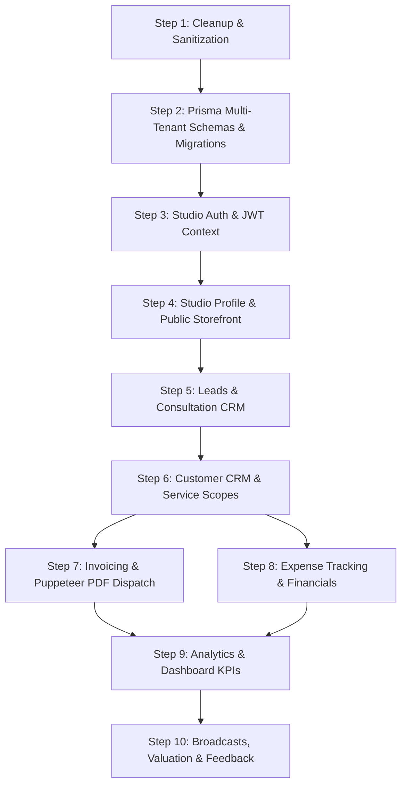

# Shopwus Backend (API) Refactoring & Progressive Roadmap

> **Target Service**: `shopwus-api` (Fastify 5 + TypeScript + Prisma + PostgreSQL + PgBoss)  
> **Target Consumer**: `shopwus-web` (Next.js 15 App Router)  
> **Status**: Template cleanup required $\rightarrow$ Progressive multi-tenant domain implementation.

---

## Table of Contents
1. [Backend Audit Summary: Strengths & Flaws](#1-backend-audit-summary)
2. [Progressive Implementation Architecture](#2-progressive-implementation-architecture)
3. [Step 1: Cleanup & Foundation Sanitization](#step-1-cleanup--foundation-sanitization)
4. [Step 2: Prisma Schemas & Database Migrations](#step-2-prisma-schemas--database-migrations)
5. [Step 3: Studio Auth & Tenant Context](#step-3-studio-auth--tenant-context)
6. [Step 4: Studio Profiles & Public Storefront Module](#step-4-studio-profiles--public-storefront-module)
7. [Step 5: Public Inquiries & Leads CRM Module](#step-5-public-inquiries--leads-crm-module)
8. [Step 6: Customer Directory & Scopes Module](#step-6-customer-directory--scopes-module)
9. [Step 7: Invoicing Engine, PDF Generation & Workers](#step-7-invoicing-engine-pdf-generation--workers)
10. [Step 8: Expense Tracking & Financials Module](#step-8-expense-tracking--financials-module)
11. [Step 9: Analytics & Performance Metrics Aggregator](#step-9-analytics--performance-metrics-aggregator)
12. [Step 10: Valuation, Broadcast & Feedback Utilities](#step-10-valuation-broadcast--feedback-utilities)
13. [Ready-to-Use Execution Prompts Matrix](#ready-to-use-execution-prompts-matrix)

---

## 1. Backend Audit Summary

### ✅ Solid Assets to Retain
- **Fastify Framework Engine**: Fast, type-safe route handling with `fastify-type-provider-zod` and `sensible`.
- **Plugin Architecture**: Custom response standardization plugin (`reply.success`, `reply.error`), global error handler plugin with Sentry logging, rate-limiting, and CORS.
- **Media Upload Pipeline**: Multi-part S3 / Cloudinary upload utility in `src/lib/mediaUpload.ts`.
- **PDF Generation Engine**: Headless Chromium / Puppeteer PDF generation ready in `src/lib/pdf.ts`.
- **Background Queue Engine**: `pg-boss` queue runner in `src/lib/pgboss.ts` and worker framework.
- **Context & Audit Trail**: AsyncLocalStorage request context tracking (`userId`, IP, User-Agent) in `src/utils/requestContext.ts`.

### ⚠️ Legacy Flaws to Clean Up (Gym Template Artifacts)
- **Routes & Controllers**: `src/modules/auth/auth.routes.ts`, `auth.controller.ts`, and `auth.schema.ts` contain references to `gym-owners/signup`, `members/signup`, `gymStaff`, `platformAdmin`, and `passcodeLogin`.
- **Background Jobs**: `src/jobs/index.ts` and `job.types.ts` contain `CHECK_MEMBERSHIP_EXPIRY`, `CHECK_AGENT_ONBOARDING_EXPIRY`, `VTpass`, and `Monnify` gym payment webhook payloads.
- **Prisma Schema State**: `prisma/schema/user.prisma` is currently blank; models for businesses, leads, customers, services, invoices, expenses, and reviews need to be defined.
- **Types & Configs**: `src/types/auth.ts`, `src/config/banks.ts`, and `billPaymentLogos.ts` contain gym/VTpass domain logic that must be removed or replaced.

---

## 2. Progressive Implementation Architecture

---

## Step 1: Cleanup & Foundation Sanitization

### Goal
Remove all leftover gym/member/VTpass code so the codebase builds cleanly with zero unused legacy baggage.

### Actions to Perform
1. **Sanitize `src/jobs/`**:
   - In `src/jobs/job.types.ts`, remove Monnify webhooks, VTpass checks, membership expiry, geocode gym, and agent commission types. Keep: `SEND_EMAIL`, `SEND_WHATSAPP`, `SEND_SMS`, `GENERATE_INVOICE_PDF`, and `SEND_BROADCAST_MESSAGE`.
   - In `src/jobs/index.ts`, remove scheduled gym checks (`CHECK_MEMBERSHIP_EXPIRY`, `CHECK_PENDING_BILLS`, `CHECK_AGENT_ONBOARDING_EXPIRY`).
2. **Sanitize `src/types/` & `src/config/`**:
   - Remove `GymStatus`, `BusinessWithGyms`, `StaffMembershipWithGym` from `src/types/auth.ts`.
   - Remove `src/config/billPaymentLogos.ts` and clean up `src/config/constants/auth.ts`.
3. **Reset `src/modules/auth/`**:
   - Replace gym-owner/member endpoints with clean studio-focused authentication (`/auth/google`, `/auth/signup`, `/auth/login`, `/auth/me`, `/auth/refresh`, `/auth/logout`, `/auth/forgot-password`, `/auth/reset-password`).
4. **Verify Clean Build**: Run `npm run build` or `pnpm build` to confirm zero compiler errors.

> **Prompt to run Step 1**:  
> *"Please execute Step 1: Clean up and sanitize `shopwus-api`. Remove all gym, member, VTpass, and Monnify leftovers from `src/jobs/`, `src/types/`, `src/config/`, and `src/modules/auth/` so the backend compiles cleanly with a studio-ready foundation."*

---

## Step 2: Prisma Schemas & Database Migrations

### Goal
Create multi-tenant, relational database models using modular Prisma schemas under `prisma/schema/`.

### Schema Files to Create
1. `prisma/schema/user.prisma`:
   - `User`: `id`, `email`, `passwordHash`, `firstName`, `lastName`, `avatarUrl`, `phone`, `role` (`OWNER`, `DIRECTOR`, `STAFF`, `SUPER_ADMIN`), `isActive`, timestamps.
   - `RefreshToken`: `id`, `userId`, `tokenHash`, `expiresAt`, `revokedAt`.
2. `prisma/schema/business.prisma`:
   - `Business` (Studio): `id`, `slug` (unique), `name`, `tagline`, `description`, `location`, `website`, `email`, `phone`, `whatsAppNumber`, `operatingHours`, `timeFrom`, `timeTo`, `byAppointmentOnly`, `logoUrl`, `businessType`, `currency`, `colors` (JSON), `buttonRadius`, `isPublished`, timestamps.
   - `BusinessUser` (Tenancy bridge): `id`, `businessId`, `userId`, `role`, timestamps.
   - `SocialChannel`: `id`, `businessId`, `type`, `connected`, `label`, `handle`, `url`.
   - `PortfolioProject`: `id`, `businessId`, `title`, `category`, `location`, `description`, `image`, `order`, `gallery` (string[]), timestamps.
   - `Review`: `id`, `businessId`, `author`, `role`, `eventType`, `rating`, `comment`, `date`, `avatar`, `isApproved`.
3. `prisma/schema/lead.prisma`:
   - `Lead`: `id`, `businessId`, `name`, `email`, `phone`, `service`, `services` (string[]), `eventDate`, `budget`, `message`, `status` (`new`, `contacted`, `qualified`, `converted`, `lost`), timestamps.
4. `prisma/schema/customer.prisma`:
   - `Customer`: `id`, `businessId`, `name`, `email`, `phone`, `company`, `totalRevenue`, `notes`, `isActive`, timestamps.
   - `CustomerService`: `id`, `businessId`, `customerId`, `name`, `service`, `amount`, `status` (`pending`, `active`, `completed`, `cancelled`), `completedAt`, timestamps.
   - `CustomerActivity`: `id`, `businessId`, `customerId`, `type`, `description`, `metadata` (JSON), `timestamp`.
5. `prisma/schema/invoice.prisma`:
   - `Invoice`: `id`, `businessId`, `customerId`, `invoiceNumber`, `customerName`, `customerEmail`, `billingAddress`, `issueDate`, `dueDate`, `paymentTerms`, `currency`, `subtotal`, `discount`, `taxRate`, `taxAmount`, `total`, `notes`, `status` (`draft`, `sent`, `paid`, `overdue`, `cancelled`), `sentAt`, `pdfUrl`, timestamps.
   - `InvoiceItem`: `id`, `invoiceId`, `description`, `quantity`, `unit`, `unitPrice`, `amount`.
6. `prisma/schema/expense.prisma`:
   - `Expense`: `id`, `businessId`, `description`, `category`, `amount`, `date`, `paymentMethod`, `vendor`, `receiptUrl`, `taxDeductible`, timestamps.
7. `prisma/schema/utility.prisma`:
   - `BroadcastCampaign`, `FeedbackRequest`, `ValuationRecord`.

### Actions to Perform
- Generate Prisma client: `pnpm prisma generate`
- Create initial migration: `pnpm prisma migrate dev --name init_shopwus_core`
- Create initial seeder in `prisma/seed.ts` (seeds default demo studio: Shopwus Forma).

> **Prompt to run Step 2**:  
> *"Please execute Step 2: Implement the multi-tenant Prisma schemas and initial migration in `shopwus-api/prisma/schema/` covering User, Business/Studio, Leads, Customers, CustomerServices, Invoices, and Expenses, and update `prisma/seed.ts`."*

---

## Step 3: Studio Auth & Tenant Context

### Goal
Implement Google OAuth verification, user onboarding with studio claiming, session persistence, and tenant extraction middleware.

### Endpoints
- `POST /api/v1/auth/google`: Verify Google ID token, resolve/create studio tenant, return access + refresh tokens.
- `POST /api/v1/auth/signup`: Studio director registration + slug reservation.
- `POST /api/v1/auth/login`: Email/password authentication.
- `GET /api/v1/auth/me`: Authenticated user & active studio profile.
- `POST /api/v1/auth/refresh`: Issue new access token from refresh token.
- `POST /api/v1/auth/logout`: Revoke active session.

### Middleware & Context
- Update `src/middlewares/auth.ts`: Attach `businessId`, `userId`, `role` to `FastifyRequest.user` and `requestContext`.
- Provide `requireStudioOwner` and `requireStudioAccess` guards.

> **Prompt to run Step 3**:  
> *"Please execute Step 3: Implement the Studio Authentication module in `shopwus-api/src/modules/auth/`, including Google OAuth verification, signup with studio slug reservation, `/auth/me`, token refresh, and tenant context extraction in `src/middlewares/auth.ts`."*

---

## Step 4: Studio Profiles & Public Storefront Module

### Goal
Allow public storefront visitors to fetch studio data and allow studio directors to edit and publish their identity, services, portfolio, and themes.

### Endpoints
- `GET /api/v1/studios/:slug` *(Public)*: Retrieve published studio storefront (branding, theme, services, portfolio, reviews).
- `GET /api/v1/studios/check-slug?slug=:slug` *(Public)*: Check slug availability.
- `GET /api/v1/studios/me` *(Auth)*: Fetch director's business profile with settings.
- `PUT /api/v1/studios/me` *(Auth)*: Update business profile, services, portfolio, theme colors, and button radius.
- `POST /api/v1/studios/me/publish` *(Auth)*: Set `isPublished = true` and update storefront cache.
- `POST /api/v1/studios/:slug/reviews` *(Public)*: Submit client review.

> **Prompt to run Step 4**:  
> *"Please execute Step 4: Build the `studios` module in `shopwus-api/src/modules/studios/` with public storefront endpoints, slug availability checker, studio profile settings manager, and review submission."*

---

## Step 5: Public Inquiries & Leads CRM Module

### Goal
Capture consultation leads from public studio storefronts and provide a pipeline management CRM in the admin dashboard.

### Endpoints
- `POST /api/v1/studios/:slug/inquiries` *(Public)*: Booking inquiry submission (creates lead with `status: 'new'`).
- `GET /api/v1/leads` *(Auth)*: Paginated leads list with query (`q`), status filter (`new|contacted|qualified|converted|lost`), and date filters.
- `GET /api/v1/leads/:id` *(Auth)*: Single lead details.
- `POST /api/v1/leads` *(Auth)*: Manual lead creation.
- `PATCH /api/v1/leads/:id/status` *(Auth)*: Update pipeline status.
- `POST /api/v1/leads/:id/convert` *(Auth)*: Convert lead into customer + create starting service scope & optional invoice draft.
- `GET /api/v1/leads/export` *(Auth)*: Download leads CSV.

> **Prompt to run Step 5**:  
> *"Please execute Step 5: Implement the `leads` module in `shopwus-api/src/modules/leads/` for public inquiry capture, pipeline status transitions, lead-to-customer conversion, and CSV export."*

---

## Step 6: Customer Directory & Scopes Module

### Goal
Manage client records, project scopes, dynamic billing history, and bulk CSV operations.

### Endpoints
- `GET /api/v1/customers` *(Auth)*: Searchable client directory with total revenue and scope counts.
- `GET /api/v1/customers/:id` *(Auth)*: Customer profile, service deliverables, invoice records, and activity timeline.
- `POST /api/v1/customers` *(Auth)*: Create customer with optional initial scope.
- `PUT /api/v1/customers/:id` *(Auth)*: Update contact details.
- `PATCH /api/v1/customers/:id/status` *(Auth)*: Toggle active status.
- `DELETE /api/v1/customers/:id` *(Auth)*: Delete customer.
- `POST /api/v1/customers/:id/services` *(Auth)*: Add service/deliverable scope.
- `PATCH /api/v1/customers/:id/services/:serviceId/status` *(Auth)*: Update scope status (`pending|active|completed|cancelled`).
- `DELETE /api/v1/customers/:id/services/:serviceId` *(Auth)*: Delete service scope.
- `POST /api/v1/customers/import` *(Auth)*: Bulk CSV customer import.
- `GET /api/v1/customers/export` *(Auth)*: Export customer list as CSV.

> **Prompt to run Step 6**:  
> *"Please execute Step 6: Implement the `customers` module in `shopwus-api/src/modules/customers/` with customer CRUD, service scope management, activity timeline logging, and CSV import/export."*

---

## Step 7: Invoicing Engine, PDF Generation & Workers

### Goal
Handle invoice drafting, sequential numbering (`INV-YYYY-XXX`), automated Puppeteer PDF compilation, and email dispatch via background workers.

### Endpoints
- `GET /api/v1/invoices` *(Auth)*: List invoices filtered by `status`, `customerId`, and date.
- `GET /api/v1/invoices/:id` *(Auth)*: Invoice detail with line items and subtotal/tax calculations.
- `POST /api/v1/invoices` *(Auth)*: Save or create draft invoice.
- `PUT /api/v1/invoices/:id` *(Auth)*: Update draft invoice.
- `POST /api/v1/invoices/:id/send` *(Auth)*: Finalize invoice, queue PDF generation & email dispatch worker.
- `POST /api/v1/invoices/:id/resend` *(Auth)*: Re-queue invoice email worker.
- `PATCH /api/v1/invoices/:id/status` *(Auth)*: Mark invoice as `paid` or `unpaid`.
- `GET /api/v1/invoices/:id/pdf` *(Auth/Public with token)*: Stream generated PDF binary.
- `POST /api/v1/customers/:customerId/invoices/send` *(Auth)*: Quick dispatch from customer card.

### Background Jobs
- `GENERATE_INVOICE_PDF` / `SEND_EMAIL`: Generate PDF via `src/lib/pdf.ts` and dispatch via `src/jobs/workers/email.worker.ts`.

> **Prompt to run Step 7**:  
> *"Please execute Step 7: Implement the `invoices` module in `shopwus-api/src/modules/invoices/` and integrate Puppeteer PDF generation with `pg-boss` background email dispatching."*

---

## Step 8: Expense Tracking & Financials Module

### Goal
Track studio operational costs, categorize expenses, attach receipts, and compute financial health metrics.

### Endpoints
- `GET /api/v1/expenses` *(Auth)*: List expenses with category, vendor, and date range filters.
- `GET /api/v1/expenses/:id` *(Auth)*: Expense detail.
- `POST /api/v1/expenses` *(Auth)*: Create expense record.
- `PUT /api/v1/expenses/:id` *(Auth)*: Edit expense.
- `DELETE /api/v1/expenses/:id` *(Auth)*: Delete expense.
- `GET /api/v1/expenses/summary` *(Auth)*: Total spent, monthly spend, budget utilization percentage.
- `GET /api/v1/expenses/categories` *(Auth)*: Aggregated category breakdown for donut chart.
- `GET /api/v1/expenses/export` *(Auth)*: Download expense CSV.

> **Prompt to run Step 8**:  
> *"Please execute Step 8: Implement the `expenses` module in `shopwus-api/src/modules/expenses/` with CRUD, receipt attachments, category aggregation, budget utilization, and CSV export."*

---

## Step 9: Analytics & Performance Metrics Aggregator

### Goal
Aggregate revenue, net profit margins, customer acquisition funnel, and service popularity across selectable timeframes (`daily`, `weekly`, `monthly`, `quarterly`, `yearly`).

### Endpoints
- `GET /api/v1/analytics/overview?timeframe=...` *(Auth)*: Key KPI cards (revenue, profit, lead conversion rate, invoice counts, recent activities).
- `GET /api/v1/analytics/revenue-chart?timeframe=...` *(Auth)*: Time-series curve comparing revenue against expenses.
- `GET /api/v1/analytics/funnel` *(Auth)*: Lead pipeline conversion funnel metrics.
- `GET /api/v1/analytics/services-performance` *(Auth)*: Ranked list of highest-earning service offerings.

> **Prompt to run Step 9**:  
> *"Please execute Step 9: Implement the `analytics` module in `shopwus-api/src/modules/analytics/` to provide high-performance database aggregation queries for the dashboard overview and charts."*

---

## Step 10: Valuation, Broadcast & Feedback Utilities

### Goal
Implement standalone utilities for studio growth, client messaging, and platform feedback.

### Endpoints
- `POST /api/v1/valuation/calculate-public` *(Public)*: Free valuation calculation + lead capture.
- `POST /api/v1/valuation/calculate-advanced` *(Auth)*: Studio valuation computed from active ledger data.
- `POST /api/v1/broadcasts/send` *(Auth)*: Queue batch broadcast campaign (Email/WhatsApp).
- `GET /api/v1/broadcasts/history` *(Auth)*: History of sent broadcasts.
- `POST /api/v1/feedback` *(Auth)*: Feature request submission.
- `GET /api/v1/feedback` *(Auth)*: List public feature requests.

> **Prompt to run Step 10**:  
> *"Please execute Step 10: Implement the utilities modules (`valuation`, `broadcasts`, `feedback`) in `shopwus-api/src/modules/`."*

---

## Ready-to-Use Execution Prompts Matrix

| Step | Scope / Deliverable | Copy-Paste Execution Prompt |
| :--- | :--- | :--- |
| **Step 1** | Cleanup & Sanitization | `Execute Step 1: Clean up and sanitize shopwus-api. Remove all gym, member, VTpass, and Monnify leftovers from src/jobs/, src/types/, src/config/, and src/modules/auth/ so the backend compiles cleanly.` |
| **Step 2** | Prisma Schemas & Migrations | `Execute Step 2: Implement multi-tenant Prisma schemas and migrations in shopwus-api/prisma/schema/ covering Users, Studios, Leads, Customers, Services, Invoices, Expenses, and seed data.` |
| **Step 3** | Studio Auth & Tenant Context | `Execute Step 3: Implement Studio Auth in shopwus-api/src/modules/auth/ with Google OAuth, studio slug claiming, /auth/me, and tenant middleware.` |
| **Step 4** | Studio Profiles & Storefront | `Execute Step 4: Build the studios module in shopwus-api/src/modules/studios/ with public storefront, slug availability, studio profile settings, and reviews.` |
| **Step 5** | Inbound Leads & CRM | `Execute Step 5: Implement the leads module in shopwus-api/src/modules/leads/ for public inquiry capture, pipeline management, conversion to customer, and CSV export.` |
| **Step 6** | Customer Directory & Scopes | `Execute Step 6: Implement the customers module in shopwus-api/src/modules/customers/ with customer CRUD, service scopes, activity timeline, and CSV import/export.` |
| **Step 7** | Invoicing Engine & PDF Workers | `Execute Step 7: Implement the invoices module in shopwus-api/src/modules/invoices/ with Puppeteer PDF generation and pg-boss email dispatch workers.` |
| **Step 8** | Expense Tracking & Financials | `Execute Step 8: Implement the expenses module in shopwus-api/src/modules/expenses/ with expense CRUD, category analytics, budget tracking, and CSV export.` |
| **Step 9** | Analytics & Dashboard KPIs | `Execute Step 9: Implement the analytics module in shopwus-api/src/modules/analytics/ for dashboard overview KPIs, revenue time-series charts, and funnel metrics.` |
| **Step 10**| Utilities & Engagement | `Execute Step 10: Implement valuation calculation, broadcast messaging workers, and feedback modules in shopwus-api/src/modules/.` |
